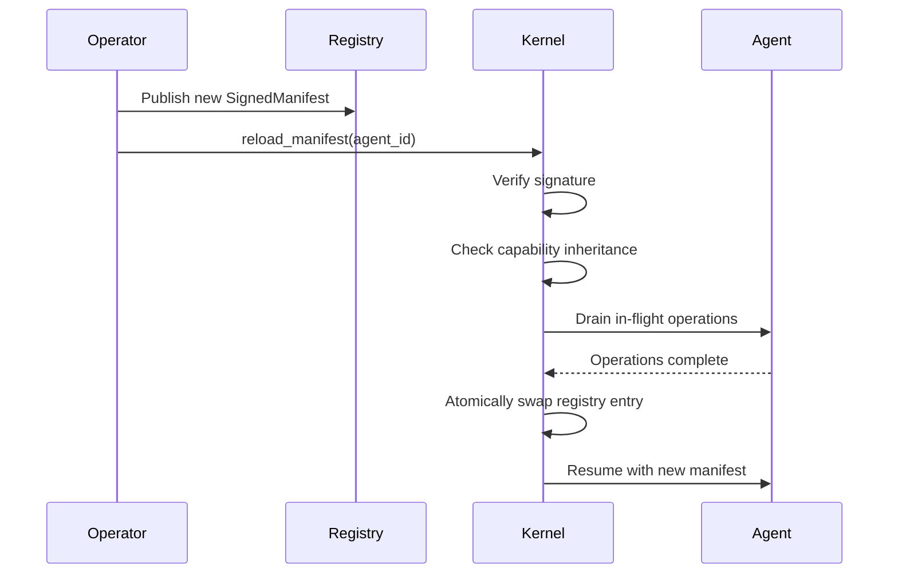
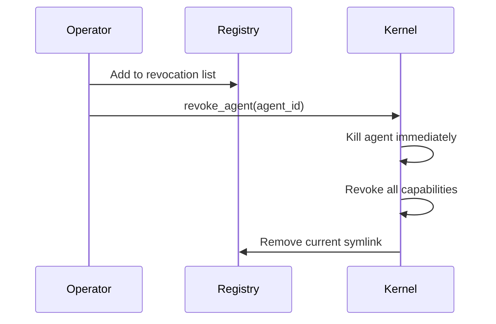

# Agent Manifest Registry Specification

## Overview

The agent manifest registry is the authoritative storage system for signed agent manifests. It provides versioning, lifecycle management, and distribution capabilities for agent systems.

## Registry Structure

```
registry/
├── agents/
│   ├── researcher-01/
│   │   ├── v1.0.0.signed.json
│   │   ├── v1.1.0.signed.json
│   │   └── current -> v1.1.0.signed.json
│   └── orchestrator-01/
│       └── ...
├── keys/
│   ├── signing.pub
│   └── revoked.json
└── templates/
    ├── base-agent.toml
    └── researcher.toml
```

### Directory Layout

- **`agents/`**: Per-agent directories containing all manifest versions
- **`keys/`**: Cryptographic keys and revocation lists
- **`templates/`**: Reusable manifest templates

### Versioning

Each agent directory contains:

- **Version files**: `v{semver}.signed.json` - Immutable signed manifests
- **Current pointer**: `current` symlink pointing to active version
- **Atomic updates**: Symlink updates ensure consistency

## Lifecycle Operations

### Hot Reload

Replace a running agent's manifest without downtime:



**Process**:

1. Publish new signed manifest to registry
2. Trigger reload operation on kernel
3. Verify signature and capability constraints
4. Drain in-flight operations gracefully
5. Atomically update registry pointer
6. Resume agent with new manifest

### Revocation

Immediately invalidate and terminate an agent:



**Process**:

1. Add agent ID to revocation list
2. Send revocation command to kernel
3. Immediately terminate agent process
4. Revoke all granted capabilities
5. Remove current symlink from registry

### Rollback

Revert to a previous manifest version by atomically updating the `current` symlink to point to the target version file.

## Storage Format

### Signed Manifest File

Each version file contains a complete `SignedManifest`:

```json
{
  "manifest": {
    "agent": { "id": "researcher-01", "name": "Research Agent" },
    "runtime": { "module": "builtin:chat", "provider": "anthropic" },
    "capabilities": { "tools": ["web_fetch"], "agent_spawn": false },
    "metadata": { "issued_at": "2025-01-16T00:00:00Z" }
  },
  "signature": "a1b2c3d4...",
  "verifying_key": "e5f6g7h8..."
}
```

### Revocation List

The `keys/revoked.json` file tracks revoked agents and keys:

```json
{
  "agents": {
    "compromised-agent-01": {
      "reason": "Security breach detected",
      "revoked_at": "2025-01-16T12:00:00Z"
    }
  },
  "keys": [
    "a1b2c3d4e5f6..."
  ]
}
```

## Registry Operations

### Publishing

Store a new manifest version by:

1. Creating version-specific file: `v{semver}.signed.json`
2. Atomically updating `current` symlink
3. Ensuring directory structure exists

### Discovery

Active manifests are identified by following `current` symlinks in agent directories.

### Version History

All versions for an agent are stored as separate files, sorted by semantic version.

### Rollback

Revert to previous version by updating the `current` symlink:

- Verify target version exists
- Remove current symlink
- Create new symlink to target version

## Template System

### Template Structure

Templates reduce duplication and enforce organizational standards:

```toml
# templates/base-agent.toml
[limits]
max_continuations = 3
max_tool_calls = 50
tool_timeout_secs = 60

[schedule]
mode = "reactive"
```

```toml
# templates/researcher.toml
_extends = "base-agent"

[runtime]
module = "builtin:chat"
provider = "anthropic"

[capabilities]
tools = ["web_fetch", "file_read"]
memory_read = ["self.*", "shared.*"]
```

### Template Resolution

Templates are resolved before signing through:

1. Loading base template if `_extends` field present
2. Recursive resolution of template chains
3. Deep merging of template hierarchy
4. Removing template-specific fields from final manifest

## Distribution and Synchronization

### Multi-Node Synchronization

In distributed systems, registries must be synchronized:

- **Push Model**: Registry publishes changes to all nodes
- **Pull Model**: Nodes periodically fetch updates
- **Gossip Model**: Changes propagate through peer-to-peer gossip

### Conflict Resolution

When multiple nodes modify the same agent:

- **Last-writer-wins**: Based on `issued_at` timestamp
- **Version-based**: Higher semantic version wins
- **Manual resolution**: Operator intervention required

## Monitoring and Observability

### Expiry Monitoring

Track manifests approaching expiration by:

1. Scanning all `current` symlinks in registry
2. Parsing `expires_at` timestamps from manifests
3. Comparing against configurable threshold (e.g., 14 days)
4. Generating alerts for expiring manifests

### Audit Trail

Track all registry operations:

```json
{
  "timestamp": "2025-01-16T12:00:00Z",
  "operation": "publish",
  "agent_id": "researcher-01",
  "version": "v1.1.0",
  "operator": "admin@example.com",
  "signature_valid": true
}
```

## Security Considerations

### Access Control

Registry operations require appropriate permissions:

- **Read**: List and retrieve manifests
- **Write**: Publish new versions
- **Admin**: Revoke agents and manage keys

### Integrity Protection

- All manifest files are cryptographically signed
- Registry metadata is protected against tampering
- Audit logs are append-only and tamper-evident

### Key Management

- Signing keys are stored securely (HSM, key vault)
- Verifying keys are distributed to all nodes
- Key rotation is supported with backward compatibility

## API Specification

### REST Endpoints

```
GET    /agents                    # List all active agents
GET    /agents/{id}               # Get current manifest
GET    /agents/{id}/versions      # List all versions
GET    /agents/{id}/versions/{v}  # Get specific version
POST   /agents/{id}               # Publish new version
DELETE /agents/{id}               # Revoke agent
POST   /agents/{id}/rollback      # Rollback to version
GET    /keys/revoked              # Get revocation list
POST   /keys/revoked              # Add to revocation list
```

### Response Format

```json
{
  "agent_id": "researcher-01",
  "current_version": "v1.1.0",
  "status": "active",
  "issued_at": "2025-01-16T00:00:00Z",
  "expires_at": "2025-04-16T00:00:00Z",
  "capabilities": {
    "tools": ["web_fetch", "file_read"],
    "agent_spawn": false
  }
}
```

This registry specification provides the foundation for robust manifest management with versioning, lifecycle operations, and security guarantees.