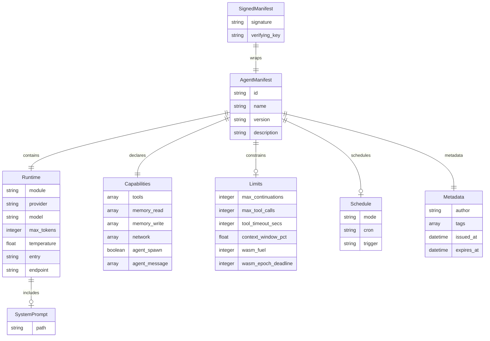
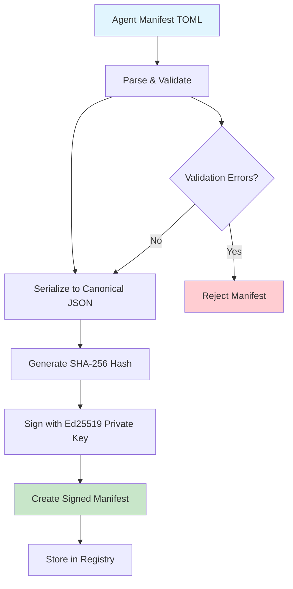
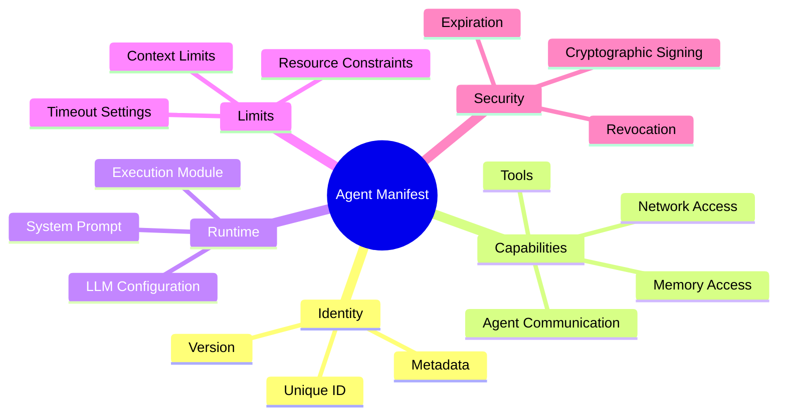
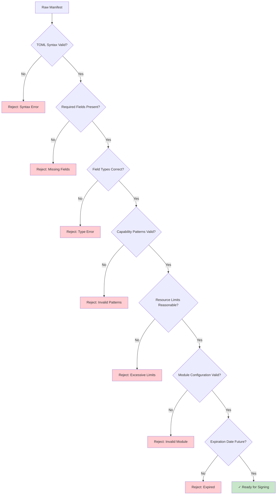

# Agent Manifest Specification

## Overview

An agent manifest is the authoritative declaration of an agent's identity, capabilities, runtime configuration, and security policies. It serves as the single source of truth that agent kernels use to spawn, authorize, and supervise agents.

## Core Principles

- **Single Source of Truth**: The manifest contains all information needed to spawn and supervise an agent
- **Capability-Based Security**: Explicit declaration of what an agent can access and do
- **Cryptographic Integrity**: Manifests are Ed25519 signed to prevent tampering
- **Immutable Identity**: Agent identity and core capabilities cannot change without re-signing

## Manifest Schema



### TOML Format

```toml
# agent.toml - Agent Manifest

# ── Identity ──────────────────────────────────────────────────────────────────
[agent]
id = "researcher-01"                    # Unique identifier (required)
name = "Research Agent"                 # Human-readable name (required)
version = "1.2.0"                      # Semantic version (optional)
description = "Multi-source research agent with credibility evaluation"

# ── Runtime Configuration ─────────────────────────────────────────────────────
[runtime]
module = "builtin:chat"                # Execution module (required)
provider = "anthropic"                 # LLM provider (conditional)
model = "claude-3-5-sonnet-20241022"  # Model identifier (conditional)
max_tokens = 8192                      # Token limit (optional)
temperature = 0.7                      # Sampling temperature (optional)

[runtime.system_prompt]
path = "prompts/researcher.md"         # System prompt file path

# ── Capabilities ──────────────────────────────────────────────────────────────
[capabilities]
tools = ["web_fetch", "file_read", "memory_read"]
memory_read = ["self.*", "shared.research.*"]
memory_write = ["self.*"]
network = ["*.wikipedia.org", "api.anthropic.com", "news.ycombinator.com"]
agent_spawn = false
agent_message = ["orchestrator"]

# ── Resource Limits ───────────────────────────────────────────────────────────
[limits]
max_continuations = 3                  # Maximum conversation continuations
max_tool_calls = 50                    # Maximum tool calls per session
tool_timeout_secs = 60                 # Tool execution timeout
context_window_pct = 0.80              # Context window usage threshold
wasm_fuel = 1_000_000                  # WASM execution fuel limit
wasm_epoch_deadline = 2                # WASM epoch timeout

# ── Scheduling ────────────────────────────────────────────────────────────────
[schedule]
mode = "reactive"                      # "reactive" | "proactive"
# cron = "0 8 * * *"                   # Cron expression for proactive mode
# trigger = "on_message"               # Trigger condition

# ── Security Metadata ─────────────────────────────────────────────────────────
[metadata]
author = "agent-research"              # Manifest author
tags = ["research", "web", "credibility"]
issued_at = "2025-01-16T00:00:00Z"     # Issuance timestamp
expires_at = "2026-01-16T00:00:00Z"    # Expiration timestamp (optional)
```

## Field Specifications

### Agent Identity (`[agent]`)

| Field         | Type   | Required | Description                                                                               |
| ------------- | ------ | -------- | ----------------------------------------------------------------------------------------- |
| `id`          | string | Yes      | Unique agent identifier used for taint tracking, registry keys, and inter-agent messaging |
| `name`        | string | Yes      | Human-readable display name                                                               |
| `version`     | string | No       | Semantic version (e.g., "1.2.0") for upgrade tracking                                     |
| `description` | string | No       | Brief description of agent purpose and capabilities                                       |

**Constraints**:

- `id` must be unique within the agent system
- `id` must be stable across restarts (used for session persistence)
- `version` must follow semantic versioning if provided

### Runtime Configuration (`[runtime]`)

| Field                | Type    | Required    | Description                                    |
| -------------------- | ------- | ----------- | ---------------------------------------------- |
| `module`             | string  | Yes         | Execution module type (see Module Types)       |
| `provider`           | string  | Conditional | LLM provider (required for `builtin:chat`)     |
| `model`              | string  | Conditional | Model identifier (required for `builtin:chat`) |
| `max_tokens`         | integer | No          | Maximum tokens per LLM call                    |
| `temperature`        | float   | No          | Sampling temperature (0.0-2.0)                 |
| `system_prompt.path` | string  | No          | Path to system prompt file                     |
| `entry`              | string  | Conditional | Entry point for executable modules             |
| `endpoint`           | string  | Conditional | Remote endpoint URL (required for `remote:*`)  |

#### Module Types

| Module             | Description                   | Required Fields     |
| ------------------ | ----------------------------- | ------------------- |
| `builtin:chat`     | Conversational agent with LLM | `provider`, `model` |
| `builtin:tool`     | Stateless function agent      | `entry`             |
| `builtin:reactive` | Event-driven agent            | None                |
| `wasm:<path>`      | WebAssembly sandboxed agent   | `entry`             |
| `python:<path>`    | Python subprocess agent       | `entry`             |
| `remote:<url>`     | Remote agent via network      | `endpoint`          |
| `docker:<image>`   | Containerized agent           | `entry`             |

### Capabilities (`[capabilities]`)

| Field           | Type          | Description                        |
| --------------- | ------------- | ---------------------------------- |
| `tools`         | array[string] | Tool names the agent may invoke    |
| `memory_read`   | array[glob]   | Memory namespaces for read access  |
| `memory_write`  | array[glob]   | Memory namespaces for write access |
| `network`       | array[glob]   | Network hosts the agent may access |
| `agent_spawn`   | boolean       | Permission to spawn child agents   |
| `agent_message` | array[string] | Agent IDs this agent may message   |

**Glob Patterns**:

- `self.*` - Agent's own namespace
- `shared.*` - Shared system namespace  
- `*.example.com` - Domain wildcards
- `specific.resource` - Exact matches

### Resource Limits (`[limits]`)

| Field                 | Type    | Description                              |
| --------------------- | ------- | ---------------------------------------- |
| `max_continuations`   | integer | Maximum conversation continuations       |
| `max_tool_calls`      | integer | Maximum tool calls per session           |
| `tool_timeout_secs`   | integer | Tool execution timeout in seconds        |
| `context_window_pct`  | float   | Context window usage threshold (0.0-1.0) |
| `wasm_fuel`           | integer | WASM execution fuel limit                |
| `wasm_epoch_deadline` | integer | WASM epoch timeout                       |

### Scheduling (`[schedule]`)

| Field     | Type   | Description                                          |
| --------- | ------ | ---------------------------------------------------- |
| `mode`    | string | "reactive" (event-driven) or "proactive" (scheduled) |
| `cron`    | string | Cron expression for proactive scheduling             |
| `trigger` | string | Trigger condition for reactive mode                  |

### Security Metadata (`[metadata]`)

| Field        | Type          | Description                               |
| ------------ | ------------- | ----------------------------------------- |
| `author`     | string        | Manifest author identifier                |
| `tags`       | array[string] | Classification tags                       |
| `issued_at`  | datetime      | Manifest issuance timestamp (ISO 8601)    |
| `expires_at` | datetime      | Expiration timestamp (ISO 8601, optional) |

## Signing Pipeline



## The Five Concerns



## Validation Before Signing



## Revocation and Key Management

### Revocation List

The system maintains a revocation list to immediately invalidate manifests without waiting for expiration:

```json
{
  "agents": {
    "compromised-agent-01": {
      "reason": "Security breach detected",
      "revoked_at": "2025-01-16T12:00:00Z"
    }
  },
  "keys": [
    "a1b2c3d4e5f6..."  // hex-encoded revoked verifying keys
  ]
}
```

### Key Rotation

1. Generate new signing key pair
2. Re-sign all active manifests with new key
3. Distribute new verifying key to all nodes
4. Add old verifying key to revocation list
5. Update trusted key configuration

### Canonical Serialization

Manifests are serialized to deterministic JSON before signing:

```python
import json

def canonical_bytes(manifest: dict) -> bytes:
    return json.dumps(manifest, sort_keys=True, separators=(',', ':')).encode('utf-8')
```

## Capability Inheritance

When an agent spawns a child, the child's capabilities must be a subset of the parent's:

```
child.capabilities ⊆ parent.capabilities (for every capability field)
```

This prevents privilege escalation through agent spawning.

## Module Field Requirements

| Field                      | `builtin:chat` | `builtin:tool` | `wasm:*` | `python:*` | `remote:*` | `docker:*` | `mcp:*`  |
| -------------------------- | -------------- | -------------- | -------- | ---------- | ---------- | ---------- | -------- |
| `provider`/`model`         | Required       | —              | —        | —          | —          | —          | —        |
| `system_prompt`            | Optional       | —              | —        | —          | —          | —          | —        |
| `max_tokens`/`temperature` | Optional       | —              | —        | —          | —          | —          | —        |
| `entry`                    | —              | Required       | Required | Required   | —          | Required   | Required |
| `endpoint`                 | —              | —              | —        | —          | Required   | —          | —        |
| `image`                    | —              | —              | —        | —          | —          | Required   | —        |

## Extended Module Types

| Module                 | Description                    | Isolation       | Stateful  |
| ---------------------- | ------------------------------ | --------------- | --------- |
| `builtin:reactive`     | Event-driven agent without LLM | In-process      | Yes       |
| `composite:<manifest>` | Fixed pipeline of sub-agents   | Inherited       | Delegated |
| `mcp:<server>`         | Model Context Protocol server  | Process/Network | Yes       |

## Validation Process

Before signing, manifests undergo comprehensive validation:

1. **Schema Validation**: Required fields, correct types
2. **Semantic Validation**: Valid glob patterns, cron expressions, module configurations
3. **Security Validation**: Dangerous capability combinations (e.g., `network=["*"]` + `agent_spawn=true`)
4. **Inheritance Validation**: Child capabilities ⊆ parent capabilities

## Signed Manifest Format

Manifests are cryptographically signed using Ed25519 to ensure integrity and authenticity.

### SignedManifest Structure

```json
{
  "manifest": { /* AgentManifest object */ },
  "signature": "hex-encoded Ed25519 signature over canonical JSON (128 hex chars)",
  "verifying_key": "hex-encoded Ed25519 public key (64 hex chars)"
}
```

### Verification Process

1. **Key Trust**: Verify the verifying key is trusted
2. **Signature**: Verify Ed25519 signature over canonical manifest
3. **Expiry**: Check `expires_at` if present
4. **Revocation**: Check against revocation list

## Registry Integration

For complete details on manifest storage, versioning, and lifecycle operations, see [Agent Manifest Registry Specification](agent-manifest-registry.md).

## JSON Schema

The complete JSON schema for agent manifests is available at:

- [agent-manifest.json](../schemas/agent-manifest.json) - Core agent manifest schema
- [signed-manifest.json](../schemas/signed-manifest.json) - Signed manifest wrapper schema
- [revocation-list.json](../schemas/revocation-list.json) - Revocation list schema

## Security Considerations

### Threat Model

- **Manifest Tampering**: Prevented by Ed25519 signatures
- **Capability Escalation**: Prevented by inheritance validation
- **Identity Spoofing**: Prevented by signed agent IDs
- **Replay Attacks**: Prevented by expiration timestamps and revocation

### Best Practices

- Use short expiration times (90 days maximum)
- Implement comprehensive revocation mechanisms
- Validate all manifests before signing
- Monitor for unusual capability patterns
- Audit manifest operations

This specification provides the foundation for secure, manageable agent systems with explicit capability control and cryptographic integrity guarantees.