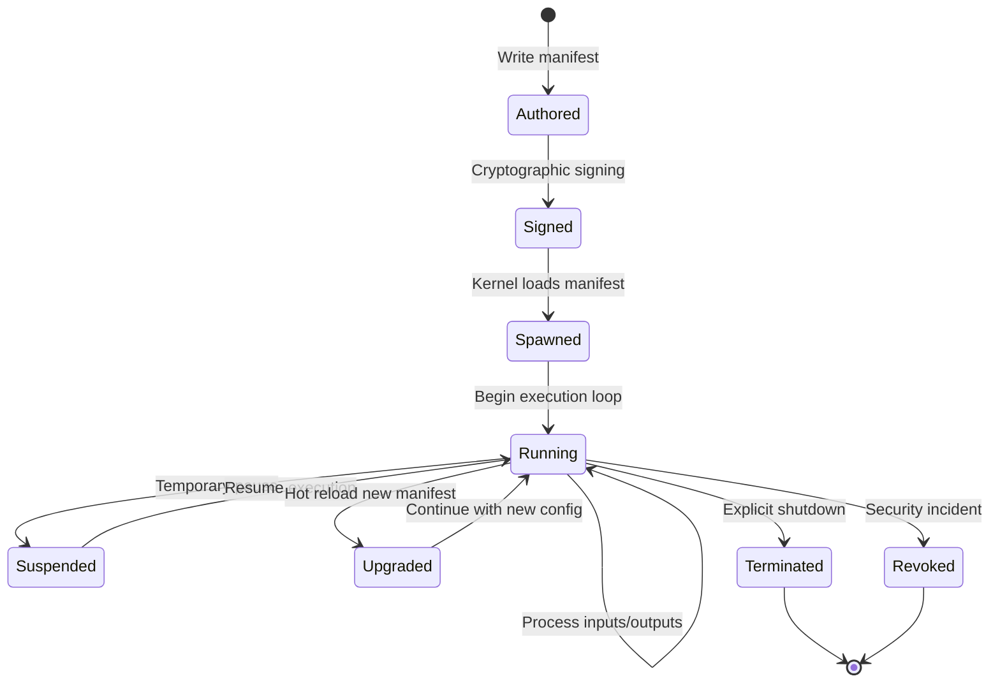

# Agent Definition

## What is an Agent?

An **agent** is an autonomous software entity with:

- **Identity**: Unique identifier and cryptographically signed manifest
- **Capabilities**: Explicit permissions defining what it can access and do
- **Runtime**: Execution environment (LLM, WASM, subprocess, container, etc.)
- **Autonomy**: Ability to make decisions and take actions within its capability bounds
- **Security Boundary**: Isolated execution with enforced capability limits

## Core Properties

### Identity
Every agent has a stable, unique identifier that persists across restarts and serves as the foundation for:
- Taint tracking and data provenance
- Inter-agent messaging and authorization
- Registry management and versioning
- Audit trails and observability

### Capabilities
Agents operate under explicit capability-based security where all permissions are declared upfront:
- **Tools**: Functions the agent may invoke
- **Memory**: Namespaces for read/write access
- **Network**: Hosts the agent may connect to
- **Agent Communication**: Other agents it may message
- **Spawning**: Permission to create child agents

### Autonomy
Agents make independent decisions within their capability bounds:
- Process inputs and generate responses
- Invoke tools to gather information or take actions
- Manage their own state and memory
- Communicate with other agents
- Spawn child agents (if permitted)

### Security Boundary
Each agent operates within enforced security constraints:
- Capability checks on every operation
- Resource limits (tokens, time, memory, fuel)
- Cryptographic integrity of manifest
- Isolation from other agents and system resources

## Agent Types

### Conversational Agents (`builtin:chat`)
- Powered by Large Language Models
- Process natural language inputs
- Generate responses through LLM inference
- Most common agent type for interactive tasks

### Tool Agents (`builtin:tool`)
- Stateless function execution
- Deterministic input-output transformation
- No LLM or conversation state
- Optimized for specific computational tasks

### Reactive Agents (`builtin:reactive`)
- Event-driven execution model
- Respond to triggers, messages, or schedules
- Maintain persistent state between activations
- No LLM required

### Sandboxed Agents (`wasm:*`)
- Execute in WebAssembly sandbox
- Strong isolation guarantees
- Fuel-based resource metering
- Suitable for untrusted code

### Remote Agents (`remote:*`)
- Execute on different nodes or systems
- Communicate via network protocols
- Capability enforcement remains local
- Enable distributed agent systems

## Agent Lifecycle



## Agent vs. Other Entities

### Agent vs. Service
- **Agent**: Autonomous, capability-bound, identity-based
- **Service**: Stateless, endpoint-based, role-based access

### Agent vs. Process
- **Agent**: Logical entity with manifest and capabilities
- **Process**: OS-level execution unit

### Agent vs. Container
- **Agent**: Security and capability abstraction
- **Container**: Resource and environment isolation

### Agent vs. Function
- **Agent**: Stateful, autonomous, long-lived
- **Function**: Stateless, invoked, short-lived

## Design Principles

### Principle of Least Privilege
Agents receive only the minimum capabilities required for their intended function.

### Explicit Over Implicit
All agent permissions, configurations, and behaviors are explicitly declared in the manifest.

### Cryptographic Integrity
Agent identity and capabilities are cryptographically signed and verified.

### Capability Inheritance
Child agents can never exceed their parent's capabilities, preventing privilege escalation.

### Immutable Identity
Core agent identity cannot change without re-signing the manifest.

## Agent System Architecture

Agents operate within a broader **agent system** that provides:

- **Agent Kernel**: Spawns, supervises, and manages agent lifecycles
- **Capability Manager**: Enforces capability-based security
- **Registry**: Stores and versions signed agent manifests
- **Taint Supervisor**: Tracks data provenance and information flow
- **Communication Layer**: Enables secure inter-agent messaging

## Examples

### Research Agent
```toml
[agent]
id = "researcher-01"
name = "Research Agent"

[capabilities]
tools = ["web_fetch", "file_read"]
network = ["*.wikipedia.org", "api.anthropic.com"]
agent_spawn = false
```

### Orchestrator Agent
```toml
[agent]
id = "orchestrator-01"
name = "Task Orchestrator"

[capabilities]
agent_spawn = true
agent_message = ["researcher-01", "coder-01"]
tools = ["memory_read", "memory_write"]
```

### Sandboxed Tool Agent
```toml
[agent]
id = "data-processor-01"
name = "Data Processing Tool"

[runtime]
module = "wasm:data-processor.wasm"

[limits]
wasm_fuel = 1_000_000
tool_timeout_secs = 30
```

This definition establishes agents as the fundamental building blocks of secure, autonomous software systems with explicit capabilities and cryptographic integrity.