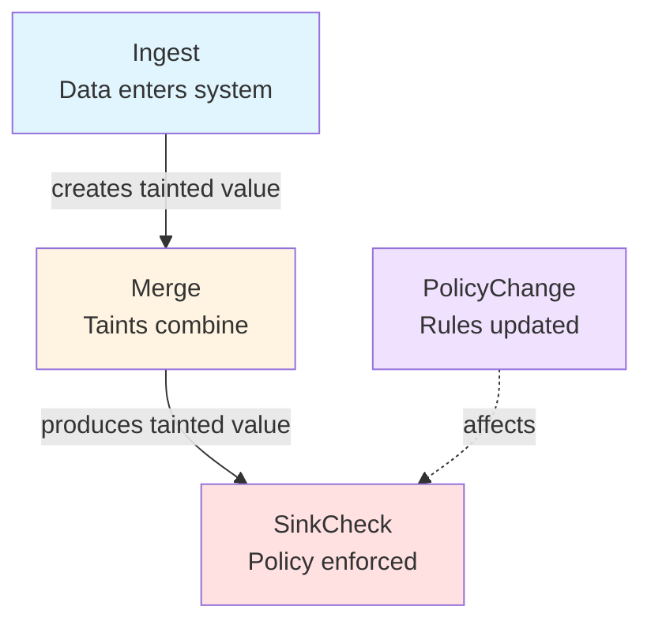
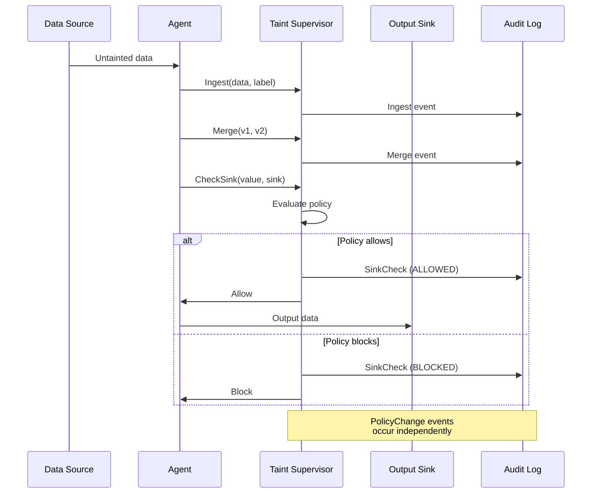
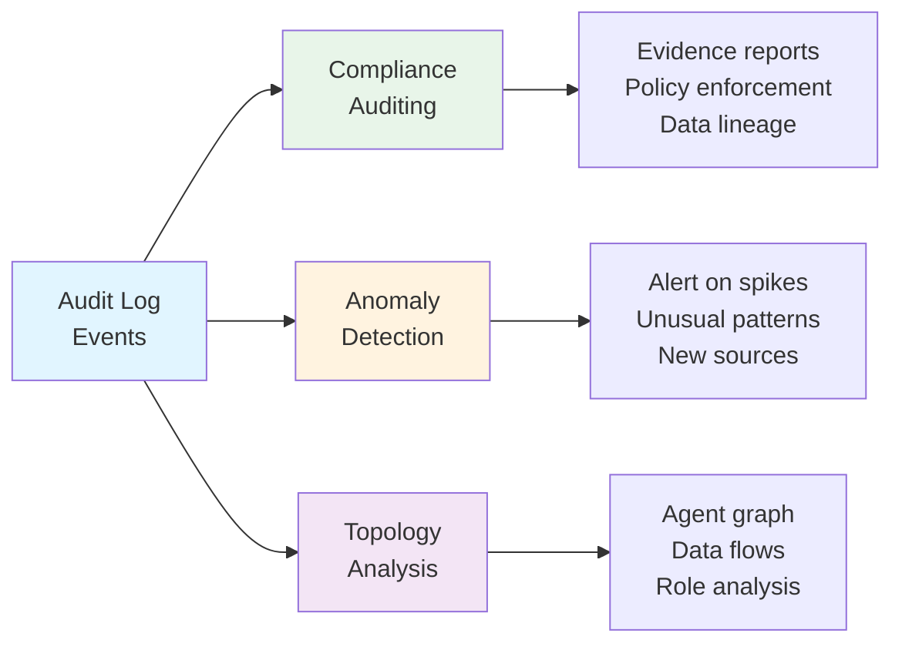

# Taint Audit Log Events

## Overview

Taint audit logs provide a complete record of information flow tracking operations. Each event captures a taint operation with sufficient detail for compliance auditing, anomaly detection, and system topology analysis.

**Format**: JSON (one event per line - JSONL)  
**Schema**: [taint-audit-event.json](../schemas/taint-audit-event.json)

## Event Type Overview



## Event Types

### Ingest

Records taint assignment at data source:

```json
{
  "type": "Ingest",
  "timestamp": "2025-01-16T12:00:00Z",
  "agent": "orchestrator",
  "value_id": "v1",
  "label": {
    "kind": "UserInput",
    "source": "user:alice"
  }
}
```

**Fields**:

- `type` - Always "Ingest"
- `timestamp` - ISO 8601 timestamp
- `agent` - Agent that performed the ingestion
- `value_id` - Unique identifier for the tainted value
- `label` - TaintLabel assigned to the value

### SinkCheck

Records policy enforcement at output boundary:

```json
{
  "type": "SinkCheck",
  "timestamp": "2025-01-16T12:00:01Z",
  "agent": "orchestrator",
  "value_id": "v3",
  "sink": "shell_execute",
  "context": "executing user command",
  "taint": [
    {"kind": "UserInput", "source": "user:alice"},
    {"kind": "ExternalFetch", "source": "url:https://news.com"}
  ],
  "result": "BLOCKED",
  "violated_kinds": ["UserInput", "ExternalFetch"]
}
```

**Fields**:

- `type` - Always "SinkCheck"
- `timestamp` - ISO 8601 timestamp
- `agent` - Agent that attempted the sink operation
- `value_id` - Identifier of the value being checked
- `sink` - Name of the sink (e.g., "shell_execute", "network_send")
- `context` - Human-readable context for the operation
- `taint` - Array of TaintLabels carried by the value
- `result` - "ALLOWED" or "BLOCKED"
- `violated_kinds` - Array of taint kinds that caused blocking (empty if allowed)

### Merge

Records taint combination operation:

```json
{
  "type": "Merge",
  "timestamp": "2025-01-16T12:00:00.5Z",
  "agent": "researcher",
  "inputs": ["v1", "v2"],
  "output": "v3"
}
```

**Fields**:

- `type` - Always "Merge"
- `timestamp` - ISO 8601 timestamp
- `agent` - Agent that performed the merge
- `inputs` - Array of input value identifiers
- `output` - Output value identifier

### PolicyChange

Records runtime policy modification:

```json
{
  "type": "PolicyChange",
  "timestamp": "2025-01-16T12:00:02Z",
  "sink": "shell_execute",
  "old_policy": ["UserInput", "ExternalFetch"],
  "new_policy": ["UserInput", "ExternalFetch", "LlmGenerated"],
  "reason": "Increased threat level"
}
```

**Fields**:

- `type` - Always "PolicyChange"
- `timestamp` - ISO 8601 timestamp
- `sink` - Sink whose policy was modified
- `old_policy` - Previous blocked taint kinds
- `new_policy` - New blocked taint kinds
- `reason` - Rationale for the change (optional)

## Event Flow Sequence



## Event Stream Example

```jsonl
{"type":"Ingest","timestamp":"2025-01-16T12:00:00.000Z","agent":"orchestrator","value_id":"v1","label":{"kind":"UserInput","source":"user:alice"}}
{"type":"Ingest","timestamp":"2025-01-16T12:00:00.100Z","agent":"researcher","value_id":"v2","label":{"kind":"ExternalFetch","source":"url:https://news.com"}}
{"type":"Merge","timestamp":"2025-01-16T12:00:00.500Z","agent":"researcher","inputs":["v1","v2"],"output":"v3"}
{"type":"SinkCheck","timestamp":"2025-01-16T12:00:01.000Z","agent":"orchestrator","value_id":"v3","sink":"shell_execute","context":"executing user command","taint":[{"kind":"UserInput","source":"user:alice"},{"kind":"ExternalFetch","source":"url:https://news.com"}],"result":"BLOCKED","violated_kinds":["UserInput","ExternalFetch"]}
{"type":"Ingest","timestamp":"2025-01-16T12:00:01.200Z","agent":"orchestrator","value_id":"v4","label":{"kind":"LlmGenerated","source":"agent:orchestrator"}}
{"type":"SinkCheck","timestamp":"2025-01-16T12:00:01.500Z","agent":"notifier","value_id":"v4","sink":"network_send","context":"sending notification","taint":[{"kind":"LlmGenerated","source":"agent:orchestrator"}],"result":"ALLOWED","violated_kinds":[]}
```

## Use Cases



### Compliance Auditing

Audit logs provide evidence of:

- What data was processed
- Where data came from (source attribution)
- What policies were enforced
- What operations were blocked

### Anomaly Detection

Analyze logs to detect:

- Unexpected agent communication patterns
- New external data sources
- Policy violation spikes
- Unusual taint accumulation

### System Topology

Reconstruct:

- Agent communication graph
- Data flow patterns
- Source influence reach
- Agent roles (source, sink, transformer, hub)

## Storage Recommendations

**Format**: JSONL (JSON Lines) - one event per line  
**Retention**: Implementation-specific (recommend 90 days minimum)  
**Indexing**: Index by timestamp, agent, sink, result for efficient queries  
**Compression**: gzip or similar for long-term storage

## Privacy Considerations

Audit logs may contain:

- User identifiers in source fields
- Sensitive context strings
- Data provenance information

Implementations SHOULD:

- Encrypt audit logs at rest
- Control access to audit logs
- Redact sensitive information if required
- Comply with data retention policies

## Related Specifications

- [Taint Supervisor](taint-supervisor.md) - Generates audit events
- [Information Flow Tracking](definition.md) - Core taint tracking concepts
- [Taint Label Schema](../schemas/taint-label.json) - TaintLabel format

## References

- JSONL Format - [jsonlines.org](https://jsonlines.org/)
- ISO 8601 Timestamps - [en.wikipedia.org/wiki/ISO_8601](https://en.wikipedia.org/wiki/ISO_8601)
