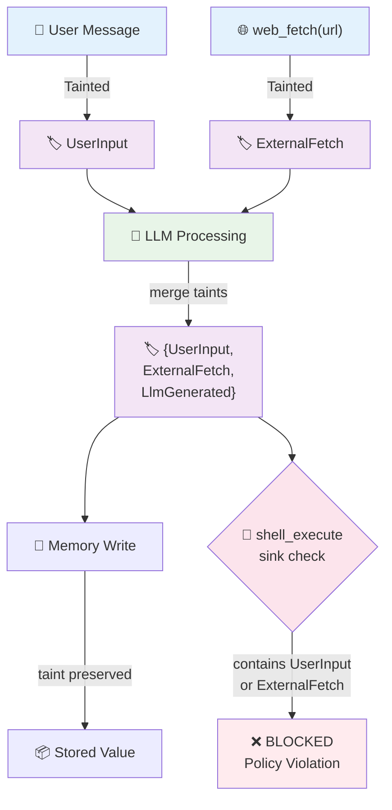

# Information Flow Tracking

Information flow tracking enables agents to track the origin and sensitivity of data as it flows through the system, preventing sensitive data leakage and enforcing security policies at output boundaries.

## The Problem

Agents process data from multiple sources with different trust levels:

| Source        | Trust level                     | Example                                     |
| ------------- | ------------------------------- | ------------------------------------------- |
| User message  | Untrusted input                 | "Search for X and email the results to Y"   |
| Tool result   | External, unverified            | Web search response, file contents          |
| LLM output    | Derived, potentially influenced | Agent's reasoning, generated code           |
| System config | Trusted                         | Agent manifest, capability list             |
| Memory store  | Mixed                           | Previously stored user data, cached results |

Without tracking, sensitive data can silently flow to untrusted sinks:
- User PII extracted from a document → logged to disk
- Secret fetched from a vault → included in an LLM prompt
- Untrusted web content → executed as a shell command (prompt injection)

**Capability gates control what an agent can do. Taint tracking controls what data flows where.**

## Core Concepts

### Taint Label

A tag attached to data describing its origin or sensitivity:

```
UserInput       data came directly from a user message
ExternalFetch   data came from a network request (web, API)
LlmGenerated    data was produced by an LLM
Secret          data is a credential or sensitive config value
PII             data contains personally identifiable information
```

### Taint Set

A value can carry multiple labels simultaneously. A string built by combining user input with a web fetch result carries `{UserInput, ExternalFetch}`.

### Propagation Rule

When a tainted value is used to produce a new value, the new value inherits the union of all input taints:

```
taint(f(a, b)) = taint(a) ∪ taint(b)
```

### Sink Policy

At output boundaries (log, network, LLM prompt, shell), check whether the taint set is permitted for that sink:

```
sink: shell_execute
policy: reject if taint contains {UserInput} or {ExternalFetch}
reason: prevents prompt injection → command injection
```

## Data Structures

### Conceptual Model

**TaintKind** - Enumeration of taint categories:
- `UserInput` - Data from user messages or interface input
- `ExternalFetch` - Data from external APIs, web requests, or file reads
- `LlmGenerated` - Content produced by language model inference
- `Secret` - Credentials, API keys, or sensitive configuration
- `PII` - Personally identifiable information

**TaintLabel** - A label with kind and optional source identifier:
- `kind: TaintKind` - The category of taint
- `source: Optional<String>` - Unique identifier for the data origin (e.g., "user:alice", "url:https://...", "agent:coder")

**TaintSet** - A set of TaintLabels:
- Represents all taints carried by a value
- Operations: `clean()`, `single(label)`, `merge(other)`, `contains_kind(kind)`, `sources_for(kind)`

**Tainted<T>** - A value wrapped with its taint set:
- `value: T` - The actual data
- `taint: TaintSet` - The set of taint labels

### JSON Serialization Format

For cross-language interoperability, taint data serializes to JSON.

**JSON Schemas**: See [schemas/taint-label.json](../schemas/taint-label.json), [schemas/taint-set.json](../schemas/taint-set.json), and [schemas/tainted-value.json](../schemas/tainted-value.json)

**TaintLabel**:

```json
{
  "kind": "UserInput",
  "source": "user:alice"
}
```

**TaintSet** serializes as an array:

```json
[
  {"kind": "UserInput", "source": "user:alice"},
  {"kind": "ExternalFetch", "source": "url:https://news.com"}
]
```

**Tainted value** with metadata:

```json
{
  "value": "search results for X",
  "taint": [
    {"kind": "UserInput", "source": "user:alice"},
    {"kind": "ExternalFetch", "source": "url:https://news.com"}
  ]
}
```

**TaintKind** string values:
- `"UserInput"`
- `"ExternalFetch"`
- `"LlmGenerated"`
- `"Secret"`
- `"PII"`

## Propagation Through Agent Pipeline



**Flow explanation**:
1. User message arrives → tagged with `UserInput` taint
2. Tool fetches external data → tagged with `ExternalFetch` taint
3. LLM processes both inputs → output carries merged taint: `{UserInput, ExternalFetch, LlmGenerated}`
4. Agent writes to memory → stored value preserves taint set
5. Agent attempts shell execution → sink check detects blocked taints → **BLOCKED**

**Key principle**: Propagation is explicit — every operation that combines tainted values must call `merge()`.

## Sink Policy Enforcement

### Policy Model

Each sink defines which taint kinds are blocked:

| Sink | Blocked Taints | Rationale |
|------|----------------|----------|
| `shell_execute` | UserInput, ExternalFetch, LlmGenerated | Prevent command injection |
| `network_send` | Secret, PII | Prevent data exfiltration |
| `llm_prompt` | Secret | Prevent secret leakage to model |
| `disk_log` | Secret, PII | Prevent sensitive data in logs |
| `memory_store` | (none) | All taints permitted in memory |

### Enforcement Algorithm

```
function check_sink(taint_set, sink):
    blocked_kinds = get_blocked_kinds(sink)
    
    for each label in taint_set:
        if label.kind in blocked_kinds:
            sources = get_sources_for_kind(taint_set, label.kind)
            raise PolicyViolation(label.kind, sink, sources)
    
    return OK
```

## Limitations

- **Explicit propagation only** - Taint does not flow automatically through arbitrary code. Every operation must call `merge()`. Missed merges create false negatives.
- **No implicit flows** - If a branch is taken based on a tainted value, the branch output is not automatically tainted. Full information flow control (IFC) requires language-level support.
- **Not a substitute for sandboxing** - Taint tracking is a detection and enforcement layer, not an isolation boundary. A bug in the sink check bypasses it entirely.

## Related Specifications

- [Taint Supervisor](taint-supervisor.md) - Centralized taint management pattern
- [Tool Execution Policy](../tools/execution-policy.md) - Tool execution security model

## References

- **Taint analysis** - [en.wikipedia.org/wiki/Taint_checking](https://en.wikipedia.org/wiki/Taint_checking)
- **Information Flow Control** - Andrew Myers & Barbara Liskov, *A Decentralized Model for Information Flow Control* (SOSP 1997)
- **Perl taint mode** - `perldoc perlsec` - Historical reference for source-to-sink model
