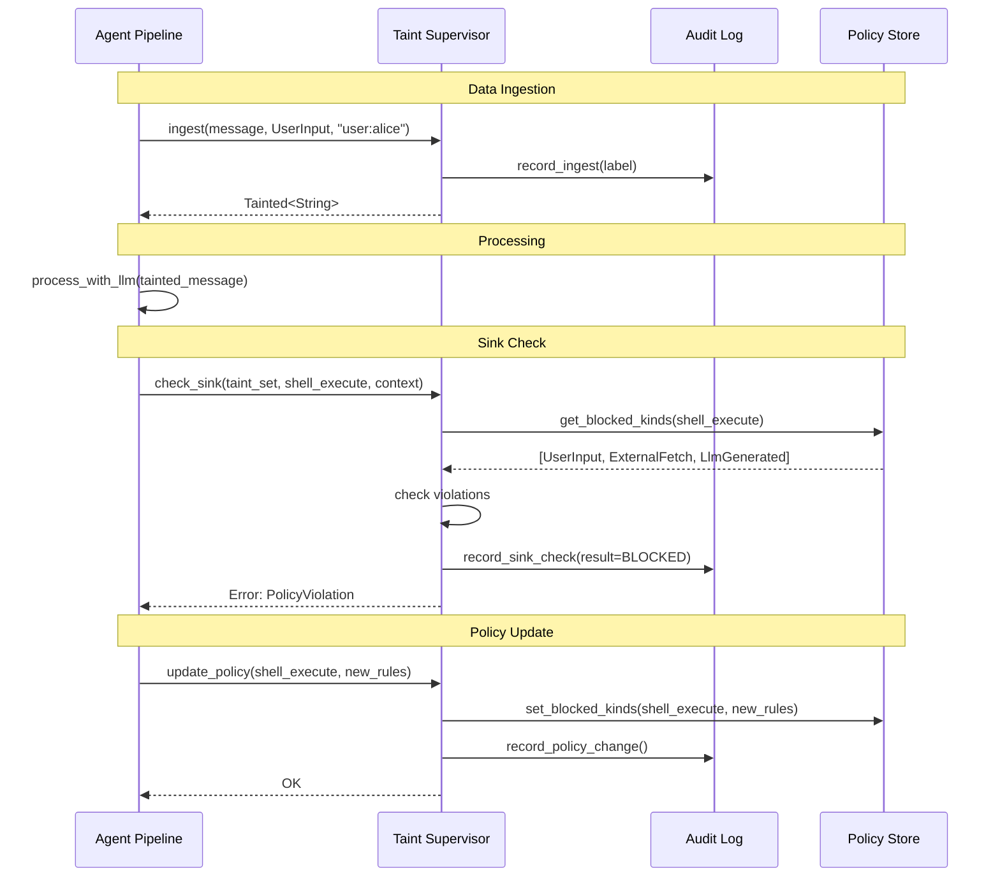

# Taint Supervisor Pattern

## Problem

Traditional taint tracking embeds taint assignment directly in pipeline code — each ingestion point calls `Tainted::with(value, label)` inline. This approach has several issues:

- **Scattered decisions** - Taint assignment logic spread across the codebase
- **Policy changes require multiple file edits** - Each sink check must be updated individually
- **No audit trail** - No centralized record of taint assignments and policy decisions
- **Inconsistent source identifiers** - Easy to forget or misapply source tracking
- **Testing complexity** - Must mock every individual call site

## Solution: Centralized Taint Supervisor

A **Taint Supervisor** centralizes three core responsibilities:

### 1. Source Registration
The only place where taint labels (with source identifiers) are assigned to raw data.

### 2. Policy Management  
Owns the sink policy table; policy changes happen in one place.

### 3. Audit Logging
Records every taint assignment and every sink check (pass or block) with full label set and source identifiers.

## Architecture

### Core Interface

**Operations**:

- `ingest(value, kind, source)` → Tainted value - Assign taint at data ingestion
- `check_sink(taint_set, sink, context)` → Result - Enforce policy at output boundary
- `update_policy(sink, blocked_kinds)` → void - Modify policy at runtime

**State**:

- `policy: SinkPolicy` - Mapping of sinks to blocked taint kinds
- `audit: AuditLog` - Record of all taint operations

### Integration Pattern

**Key interactions**:

1. **Ingest**: Pipeline calls supervisor to tag data at entry points
2. **Check**: Pipeline calls supervisor before outputting data
3. **Audit**: Supervisor logs all operations automatically
4. **Policy**: Supervisor manages policy centrally

**Usage**:

1. Inject supervisor into agent pipeline
2. Call `supervisor.ingest()` at all data entry points
3. Call `supervisor.check_sink()` at all output boundaries
4. Never construct TaintLabel directly in pipeline code

## Benefits Over Inline Assignment

| Concern | Inline Assignment | Taint Supervisor |
|---|---|---|
| **Policy changes** | Touch every sink check | Change one policy table |
| **Audit trail** | None by default | Every ingest + check logged |
| **Source identifiers** | Optional, easy to forget | Enforced at single entry point |
| **Testability** | Mock each call site | Mock one object |
| **Taint label creation** | Scattered across codebase | Centralized, auditable |
| **Policy consistency** | Manual synchronization | Single source of truth |
| **Runtime policy updates** | Requires code changes | Dynamic policy modification |

## Audit Log Structure

The supervisor generates a structured audit log of all taint operations.

**Event Types**:
- `Ingest` - Taint assignment at data source
- `SinkCheck` - Policy enforcement at output boundary
- `Merge` - Taint combination operation
- `PolicyChange` - Runtime policy modification

**Event Fields**:
- `timestamp` - When the event occurred
- `agent` - Which agent performed the operation
- `label` / `taint` - Taint information
- `sink` / `context` - Where the operation occurred
- `result` - Success or violation

**Format**: JSONL (JSON Lines) - one event per line  
**Schema**: See [audit-events.md](audit-events.md) and [taint-audit-event.json](../schemas/taint-audit-event.json)

## Advanced Capabilities

### Dynamic Policy Updates
Modify policies at runtime based on threat level, user context, or system state.

### Policy Templates
Apply predefined policy sets (strict, permissive, custom) for different deployment scenarios.

### Audit Analysis
Analyze audit logs to detect patterns, generate compliance reports, and identify anomalies.

## Implementation Considerations

### Performance

- **Audit overhead** - Logging every operation adds latency
- **Policy lookup** - Cache frequently accessed policies
- **Lock contention** - Use read-write locks for policy access

### Scalability

- **Distributed systems** - Supervisor per agent vs. centralized supervisor
- **Audit storage** - Structured logging vs. database storage
- **Policy synchronization** - Consistent policy updates across agents

### Security

- **Supervisor compromise** - If supervisor is compromised, entire taint system fails
- **Audit integrity** - Protect audit logs from tampering
- **Policy validation** - Ensure policy updates don't create security holes

## Related Patterns

- **Policy Engine** - External policy management system
- **Audit Trail** - Comprehensive logging for compliance
- **Centralized Configuration** - Single source of truth for system behavior
- **Observer Pattern** - Audit logging as event observation

This pattern transforms taint tracking from a scattered implementation concern into a centralized, auditable, and manageable security service.