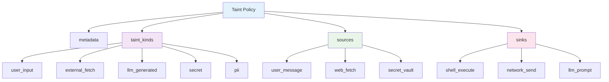
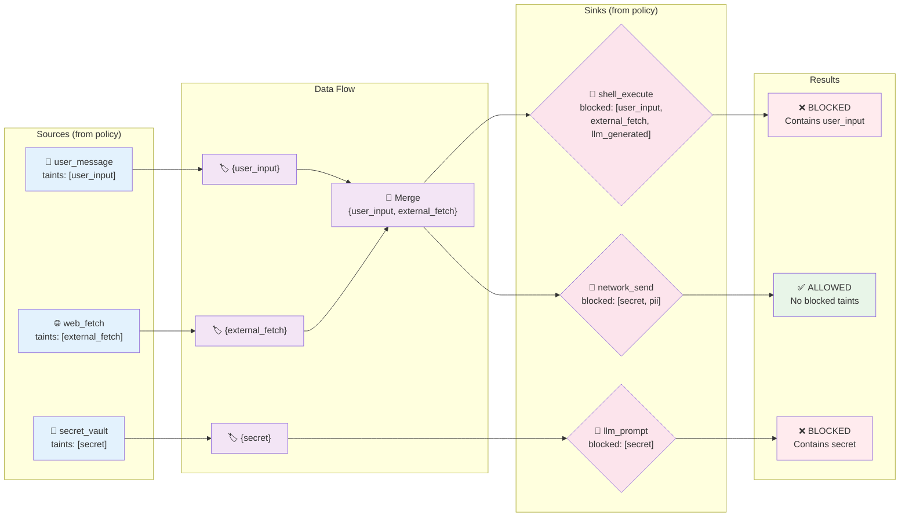

# Taint Specification Language (TSL) Core

## Overview

TSL Core provides a declarative YAML format for defining information flow tracking policies. Policies are specified externally and loaded at runtime, enabling policy-as-code and cross-implementation portability.

**Version**: 1.0  
**Format**: YAML  
**Schema**: [tsl-policy.json](../schemas/tsl-policy.json)

## Policy Structure



## Information Flow Example



This diagram shows how TSL policy definitions control information flow from sources to sinks.

## Core Components

### 1. Metadata

```yaml
metadata:
  name: "Agent System Taint Policy"
  version: "1.0.0"
  description: "Information flow tracking policy for multi-agent system"
  author: "Security Team"
```

### 2. Taint Kinds

Define taint categories with descriptions:

```yaml
taint_kinds:
  user_input:
    description: "Data from user messages or interface input"
    
  external_fetch:
    description: "Data from external APIs, web requests, or file reads"
    
  llm_generated:
    description: "Content produced by language model inference"
    
  secret:
    description: "Credentials, API keys, or sensitive configuration"
    
  pii:
    description: "Personally identifiable information"
```

**Rules**:

- Taint kinds are flat (no hierarchies)
- Each kind has a unique name and description
- Names use snake_case

### 3. Sources

Define where taint originates:

```yaml
sources:
  user_message:
    taints: [user_input]
    pattern: "user:*"
    description: "User messages in chat interface"
    
  web_fetch:
    taints: [external_fetch]
    pattern: "url:*"
    description: "HTTP requests to external URLs"
    
  secret_vault:
    taints: [secret]
    pattern: "vault:*"
    description: "Secrets retrieved from vault"
    
  llm_inference:
    taints: [llm_generated]
    pattern: "agent:*"
    description: "LLM model outputs"
```

**Fields**:

- `taints` - Array of taint kinds assigned to data from this source
- `pattern` - Glob pattern for source identifiers (optional)
- `description` - Human-readable description

### 4. Sinks

Define output boundaries and blocked taints:

```yaml
sinks:
  shell_execute:
    description: "Shell command execution"
    blocked_taints: [user_input, external_fetch, llm_generated]
    reason: "Prevent command injection attacks"
    
  network_send:
    description: "Network requests and responses"
    blocked_taints: [secret, pii]
    reason: "Prevent data exfiltration"
    
  llm_prompt:
    description: "Input to language model"
    blocked_taints: [secret]
    reason: "Prevent secret leakage to model"
    
  disk_log:
    description: "Disk logging"
    blocked_taints: [secret, pii]
    reason: "Prevent sensitive data in logs"
    
  memory_store:
    description: "In-memory data storage"
    blocked_taints: []
    reason: "All taints permitted in memory"
```

**Fields**:

- `description` - Human-readable description
- `blocked_taints` - Array of taint kinds blocked at this sink
- `reason` - Rationale for the policy

## Complete Example

```yaml
# taint-policy.yaml
version: "1.0"

metadata:
  name: "Agent System Taint Policy"
  version: "1.0.0"
  description: "Information flow tracking policy for multi-agent system"
  author: "Security Team"

taint_kinds:
  user_input:
    description: "Data from user messages or interface input"
  external_fetch:
    description: "Data from external APIs, web requests, or file reads"
  llm_generated:
    description: "Content produced by language model inference"
  secret:
    description: "Credentials, API keys, or sensitive configuration"
  pii:
    description: "Personally identifiable information"

sources:
  user_message:
    taints: [user_input]
    pattern: "user:*"
    description: "User messages in chat interface"
    
  web_fetch:
    taints: [external_fetch]
    pattern: "url:*"
    description: "HTTP requests to external URLs"
    
  secret_vault:
    taints: [secret]
    pattern: "vault:*"
    description: "Secrets retrieved from vault"
    
  llm_inference:
    taints: [llm_generated]
    pattern: "agent:*"
    description: "LLM model outputs"

sinks:
  shell_execute:
    description: "Shell command execution"
    blocked_taints: [user_input, external_fetch, llm_generated]
    reason: "Prevent command injection attacks"
    
  network_send:
    description: "Network requests and responses"
    blocked_taints: [secret, pii]
    reason: "Prevent data exfiltration"
    
  llm_prompt:
    description: "Input to language model"
    blocked_taints: [secret]
    reason: "Prevent secret leakage to model"
    
  disk_log:
    description: "Disk logging"
    blocked_taints: [secret, pii]
    reason: "Prevent sensitive data in logs"
```

## Propagation Model

TSL Core uses **explicit union-based propagation**:

```
taint(f(a, b)) = taint(a) ∪ taint(b)
```

When values are combined, their taint sets merge. This is the only propagation rule in TSL Core v1.0.

## Policy Loading

Implementations MUST:
1. Parse YAML according to the schema
2. Validate all referenced taint kinds exist
3. Validate source patterns are valid globs
4. Validate sink blocked_taints reference defined taint kinds

## Validation Rules

**Taint Kinds**:

- Names must be unique
- Names must use snake_case
- Description is required

**Sources**:

- Must reference defined taint kinds
- Pattern is optional but must be valid glob if present

**Sinks**:

- Must reference defined taint kinds in blocked_taints
- Empty blocked_taints array is valid (permits all taints)

## Benefits

- **Declarative** - Policies separate from code
- **Portable** - Same format across implementations
- **Versionable** - Policies in version control
- **Auditable** - Clear documentation of security policies
- **Flexible** - Runtime policy updates without code changes

## Limitations

TSL Core v1.0 does NOT support:

- Hierarchical taint relationships
- Automatic taint propagation
- Pattern-based untainting
- Transform operations
- Sensitivity levels
- Conditional policies

These features are experimental and need to be documented.

## Related Specifications

- [Information Flow Tracking](definition.md) - Core taint tracking concepts
- [Taint Supervisor](taint-supervisor.md) - Centralized taint management pattern
- [JSON Schemas](../schemas/README.md) - Validation schemas for taint data

## References

- YAML 1.2 Specification - [yaml.org/spec/1.2/spec.html](https://yaml.org/spec/1.2/spec.html)
- JSON Schema Draft 2020-12 - [json-schema.org](https://json-schema.org/)
