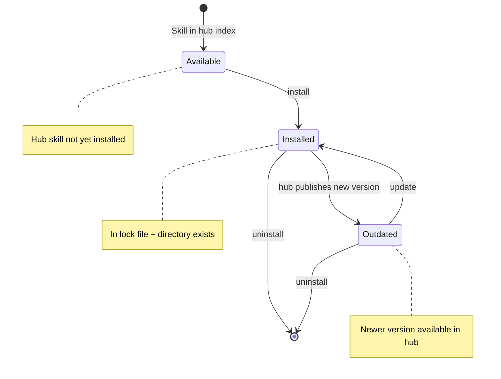

# Skill Lifecycle Specification

## 1. Purpose

This specification defines how skills transition between states (available → installed → updated → removed) and how agents track, version, and resolve conflicts between skill sources.

---

## 2. Lifecycle States

A skill exists in one of three states:

**Available**: Present in a hub index, not installed locally
**Installed**: Present in local skills directory, tracked in lock file (hub skills) or detected by scan (local skills)
**Outdated**: Installed hub skill with newer version available in hub

### State Diagram



---

## 3. Skill Identity

### Hub Skills

**Unique identifier**: `hub_id:slug`
- `hub_id`: Hub source identifier from agent configuration
- `slug`: Skill name within that hub
- Example: `official-hub:python-developer`

**Versioning**: Semantic versioning (MAJOR.MINOR.PATCH)
**Immutability**: Each version pinned to a git commit hash

### Local Skills

**Unique identifier**: Directory name
**Versioning**: Not versioned by system (user-managed)
**Immutability**: Not enforced

---

## 4. Lock File Contract

## 4. Lock File Contract

**Purpose**: Record installed hub skills with version and source information

**Scope**: Hub-installed skills only (local skills discovered by directory scan)

**Schema**: [`schemas/skills-lock.json`](../schemas/skills-lock.json)

**Format**: JSON with structure:

```json
{
  "version": "1.0",
  "skills": {
    "<hub_id:slug>": {
      "hub_id": "string",
      "slug": "string",
      "version": "semver string",
      "commit": "git commit hash",
      "installed_path": "relative path",
      "installed_at": "ISO 8601 timestamp"
    }
  }
}
```

**Key properties**:
- Composite key `hub_id:slug` allows same skill from different hubs
- `commit` pins exact source state for reproducibility
- `installed_path` supports custom directory names for conflict resolution

---

## 5. State Transitions

### Available → Installed

**Trigger**: User installs skill from hub

**Requirements**:
- Skill exists in hub's `index.json`
- No directory conflict at target path
- Valid `SKILL.md` with required frontmatter

**Actions**:
1. Fetch skill directory from hub at pinned commit
2. Copy to local skills directory (SKILL.md, lifecycle.yaml, scripts/, references/, assets/)
3. Add entry to lock file
4. If skill includes `lifecycle.yaml`, execute install commands with user approval

**Postcondition**: Skill in lock file, directory exists

### Installed → Updated

**Trigger**: User updates skill, newer version available

**Requirements**:
- Skill in lock file
- Hub `index.json` shows higher version number

**Actions**:
1. Fetch new version from hub
2. Replace directory contents
3. If skill includes `lifecycle.yaml`, execute update commands with user approval
4. Update lock file entry (version, commit, timestamp)

**Postcondition**: Lock file reflects new version

### Installed → Removed

**Trigger**: User uninstalls skill

**Actions**:
1. If skill includes `lifecycle.yaml`, execute uninstall commands with user approval
2. Remove directory
3. Remove lock file entry (if hub skill)

**Postcondition**: Directory and lock entry absent

---

## 6. Conflict Resolution

### Directory Name Conflicts

**Problem**: Two hubs provide `python-developer`, both want `skills/python-developer/`

**Resolution**: Second install must specify alternate path
- Lock key remains `hub_id:slug`
- `installed_path` differs: `skills/python-developer-alt/`

### Hub vs Local Conflicts

**Problem**: Local skill exists at target path

**Resolution**: Installation fails with error
- User must rename or remove local skill first
- System does not auto-merge or overwrite local skills

### Version Conflicts

**Problem**: Skill already installed from same hub

**Resolution**: Installation fails, user must update instead

---

## 7. Discovery and Loading

### Discovery Phase (Startup)

**Hub skills**: Read from lock file
**Local skills**: Scan skills directory for entries not in lock file

**For each skill**:
1. Parse `SKILL.md` frontmatter (name, description, compatibility)
2. Add to available skills (name + description only)

**Note**: The `compatibility` field is informational only. Skills are not automatically gated. The agent reads compatibility and may warn users about missing requirements.

### Activation Phase (Runtime)

**Trigger**: Agent determines skill is relevant

**Action**: Load full `SKILL.md` body into context

**Progressive disclosure**: Only activated skills consume context

---

## 8. Versioning Semantics

**Hub skills**: Semantic versioning (MAJOR.MINOR.PATCH)
- MAJOR: Breaking changes to skill interface or behavior
- MINOR: New capabilities, backward compatible
- PATCH: Bug fixes, documentation updates

**Local skills**: No version tracking by system

**Update policy**: User-initiated only (no automatic updates)

**Rollback**: Not specified (implementation may support via backup)

---

## 9. Portability and Reproducibility

**Lock file enables**:
- Exact skill versions recorded
- Git commit hashes for immutability
- Reproducible installs across machines

**Export format**: List of `hub_id:slug@version` entries

**Import behavior**: Install all skills from manifest at specified versions

---

## 10. Security Considerations

**Trust boundary**: Hub operator's CI validation
- Lock file records hub source and commit
- User trusts hub, not individual skill authors

**Lifecycle commands**: If skill includes `lifecycle.yaml`
- All install/update/uninstall commands require user approval
- Commands are visible in lifecycle.yaml (auditable)
- No hidden or obfuscated commands

**Integrity**: Git commit hash ensures content matches expected state

---

## 11. Lifecycle Commands

**Skills may include lifecycle.yaml** for agent-assisted dependency management:

```
python-dev-skill/
├── SKILL.md
├── lifecycle.yaml
├── scripts/
└── references/
```

**Installation behavior**:
- If `lifecycle.yaml` exists, agent reads install commands
- Agent presents commands to user for approval
- User approves each command individually
- Agent executes approved commands

**Update behavior**:
- Agent reads update commands from new version's `lifecycle.yaml`
- User approval required for each command

**Uninstallation behavior**:
- Agent reads uninstall commands from `lifecycle.yaml`
- User approval required for cleanup commands

**See**: [authoring-guide.md](authoring-guide.md) for lifecycle.yaml format

---

## 12. Design Principles

**Explicit over implicit**: User initiates all installs, updates, removals

**Local skills are first-class**: No lock file entry required, discovered by scan

**Hub skills are versioned**: Lock file tracks exact state for reproducibility

**Conflicts are errors**: System does not auto-resolve, user must decide

**Progressive disclosure**: Only load full skill content when activated

---

## Related Specifications

- [definition.md](definition.md) — What skills are
- [authoring-guide.md](authoring-guide.md) — How to write skills  
- [hub.md](hub.md) — Hub system and index.json format
