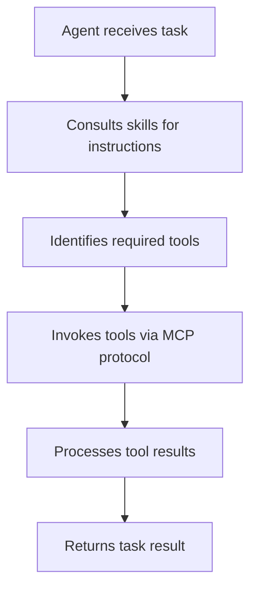

# Tool Execution Policy

## 1. Core Principle

**All tool interactions MUST go through MCP protocol**. No direct command execution.

---

## 2. Rationale

### Security
- **Process isolation**: Tools run in separate MCP server processes
- **Permission control**: Host controls which MCP servers are enabled
- **Sandboxing**: No direct shell access from agent

### Auditability
- **Logging**: All tool calls logged through MCP protocol
- **Traceability**: Clear record of what tools were invoked with what parameters
- **Compliance**: Audit trail for regulated environments

### Portability
- **Reusability**: Same MCP servers work across different agents
- **Standardization**: MCP protocol is vendor-neutral
- **Interoperability**: Tools work with any MCP-compatible host

---

## 3. Execution Model

### Agent Task Flow



### No Direct Execution

**Prohibited**:
- Direct shell commands (`subprocess`, `os.system`)
- Direct file operations (except reading own config)
- Direct network requests (except MCP communication)

**Required**:
- File operations → MCP filesystem server
- Git operations → MCP git server
- HTTP requests → MCP http server
- Database queries → MCP database server

---

## 4. Tool Discovery

**MCP servers declare available tools**:
```json
{
  "tools": [
    {
      "name": "read_file",
      "description": "Read file contents",
      "inputSchema": { ... }
    }
  ]
}
```

**Agent queries available tools** via `tools/list` before task execution

---

## 5. Tool Invocation

**Request** (agent → MCP server):
```json
{
  "method": "tools/call",
  "params": {
    "name": "read_file",
    "arguments": {
      "path": "/path/to/file"
    }
  }
}
```

**Response** (MCP server → agent):
```json
{
  "result": {
    "content": "file contents..."
  }
}
```

---

## 6. Error Handling

**Tool errors returned via MCP**:
```json
{
  "error": {
    "code": -32000,
    "message": "File not found"
  }
}
```

**Agent responsibility**: Handle errors gracefully, retry if appropriate

---

## 7. Exceptions

**Allowed direct operations**:
- Reading agent's own configuration files
- Logging to agent's log files
- Internal state management

**Everything else**: MCP protocol

---

## 8. Security Benefits

**Attack surface reduction**: No shell injection vulnerabilities
**Least privilege**: Each MCP server has limited permissions
**Audit compliance**: Complete tool usage logs
**Revocation**: Disable MCP servers without code changes

---

## 9. Performance Considerations

**Overhead**: MCP adds process communication overhead
**Mitigation**: Batch operations when possible
**Trade-off**: Security and auditability worth the cost

**Not suitable for**: Tight loops, high-frequency operations (use built-in functions)

---

## Related Specifications

- [MCP Protocol](../tools/mcp-protocol.md) - Tool execution protocol
- [Tool Definition](../tools/definition.md) - What tools are
- [Skill Definition](../skills/definition.md) - Skills provide instructions, tools provide execution
