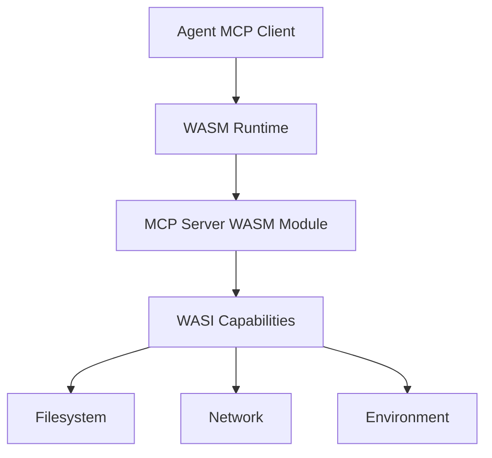

# MCP Servers as WASM Components

## 1. Overview

MCP servers deployed as **WebAssembly components** provide secure, portable, and scalable tool execution through capability-based sandboxing.

**Purpose**: Solve MCP deployment, security, and scale challenges using WASM Component Model.

---

## 2. Architecture



**WASM Runtime**: wasmtime, wasmer, or embedded runtime
**MCP Server**: Compiled to `.wasm` component
**WASI**: Capability-based access to system resources

---

## 3. Benefits

### Security

**Sandboxing**: Each MCP server runs in isolated WASM sandbox
**Capabilities**: Explicit grants for filesystem, network, environment access
**No shell access**: Cannot execute arbitrary commands
**Memory safety**: WASM memory isolation

### Portability

**Cross-platform**: Same `.wasm` runs on Linux, macOS, Windows
**No dependencies**: Self-contained binary
**Language-agnostic**: Write in Rust, Go, C, etc., compile to WASM

### Scalability

**Lightweight**: Fast startup (<10ms), low memory overhead
**Multi-tenancy**: Multiple isolated servers per host
**Resource limits**: Runtime enforces CPU/memory limits
**Easy distribution**: Single `.wasm` file

---

## 4. WASM Component Model

### Interface Definition (WIT)

```wit
package mcp:server

interface tools {
  record tool-definition {
    name: string,
    description: string,
    input-schema: string,
  }
  
  list-tools: func() -> list<tool-definition>
  
  call-tool: func(name: string, arguments: string) -> result<string, string>
}

world mcp-server {
  export tools
  import wasi:filesystem/types
  import wasi:http/outgoing-handler
}
```

### Component Structure

**Exports**: MCP protocol methods (list-tools, call-tool)
**Imports**: WASI capabilities (filesystem, network)
**Composition**: Multiple components can be linked

---

## 5. Capability-Based Security

### WASI Permissions

**Filesystem**:
```
--dir /allowed/path::/mount/point
```
Only specified directories accessible

**Network**:
```
--allow-net=api.example.com:443
```
Only specified hosts/ports accessible

**Environment**:
```
--env API_KEY
```
Only specified env vars accessible

### No Capabilities by Default

MCP server has **zero access** unless explicitly granted by runtime configuration.

---

## 6. Deployment Model

### Standalone Distribution

**Direct download**: MCP server WASM modules distributed independently
```bash
agentctl mcp install filesystem
# Downloads filesystem.wasm
# Configures with specified capabilities
# Registers with agent
```

### Bundled with Skills

**Skill-bundled**: MCP servers included in skill `assets/` directory
```
python-dev-skill/
├── SKILL.md
└── assets/
    └── python-tools.wasm
```

**Installation**: Skill installation automatically registers bundled MCP servers
```bash
agentctl skill install official:python-dev
# Installs SKILL.md
# Registers assets/python-tools.wasm as MCP server
# Skill instructions reference bundled tools
```

**See**: [Skill Lifecycle](../skills/lifecycle.md) for skill installation specification

### Hub-Based Distribution

### Hub-Based Distribution

**MCP hub index entry** (per [mcp-index.json schema](../schemas/mcp-index.json)):
```json
{
  "id": "filesystem",
  "name": "Filesystem Tools",
  "description": "Read and write files with capability-based access",
  "version": "1.0.0",
  "wasm_url": "https://hub.example.com/servers/filesystem.wasm",
  "wasm_hash": "sha256:abc123...",
  "capabilities": {
    "filesystem": ["/allowed/path"],
    "network": [],
    "env": []
  },
  "tools": ["read_file", "write_file", "list_directory"]
}
```

**Skill with bundled MCP** (per [skills-index.json schema](../schemas/skills-index.json)):
```json
{
  "id": "python-dev",
  "name": "Python Developer",
  "mcp_servers": [
    {
      "wasm_file": "assets/python-tools.wasm",
      "wasm_hash": "sha256:def456...",
      "capabilities": {
        "filesystem": ["/workspace"],
        "network": ["pypi.org:443"]
      },
      "tools": ["run_python", "install_package"]
    }
  ]
}
```

### Installation

```bash
agentctl mcp install filesystem
# Downloads filesystem.wasm
# Configures with specified capabilities
# Registers with agent
```

### Runtime Configuration

**Agent config**:
```json
{
  "mcp_servers": {
    "filesystem": {
      "wasm_module": "~/.agentctl/mcp/filesystem.wasm",
      "capabilities": {
        "dirs": ["/home/user/documents::/docs"],
        "network": [],
        "env": []
      }
    }
  }
}
```

---

## 7. Lifecycle Management

### Startup

**On-demand**: Runtime spawns WASM instance when agent needs tool
**Persistent**: Long-running WASM instance for stateful servers
**Pooling**: Pre-warmed instances for fast response

### Updates

**Atomic**: Replace `.wasm` file, restart instance
**Versioning**: Multiple versions can coexist
**Rollback**: Keep previous `.wasm` for rollback

### Monitoring

**Metrics**: Runtime exposes CPU, memory, call count
**Logging**: WASM stdout/stderr captured
**Tracing**: Distributed tracing through WASI

---

## 8. Multi-Tenancy

### Shared Host

**Isolation**: Each user's MCP servers in separate WASM instances
**Resource limits**: Per-instance CPU/memory quotas
**Capability separation**: Each instance has own filesystem/network grants

### Example

```
Host
├── User A
│   ├── filesystem.wasm (access: /home/userA)
│   └── git.wasm (access: /home/userA/repos)
└── User B
    ├── filesystem.wasm (access: /home/userB)
    └── database.wasm (network: localhost:5432)
```

---

## 9. Performance Considerations

**Startup**: <10ms for typical MCP server
**Memory**: ~1-5MB per instance
**Overhead**: ~5-10% vs native for I/O-bound operations
**Optimization**: Ahead-of-time compilation for production

**Trade-off**: Slight performance cost for security and portability

---

## 10. Implementation Standards

### WASM Component Requirements

**Must export**: MCP protocol interface (tools/list, tools/call)
**Must import**: Only required WASI capabilities
**Must handle**: Graceful shutdown on SIGTERM
**Must log**: Errors to stderr

### Runtime Requirements

**Must enforce**: Capability restrictions
**Must provide**: Resource limits (CPU, memory)
**Must support**: Component Model specification
**Must enable**: Observability (metrics, logs)

---

## 11. Comparison to Other Approaches

### WASM vs Native Processes

**WASM**:
- Sandboxed by default
- Portable across platforms
- Fast startup, low overhead
- Capability-based security

**Native**:
- Full system access
- Platform-specific binaries
- Slower startup
- OS-level permissions

### WASM vs Containers

**WASM**:
- Lighter weight (~MB vs ~GB)
- Faster startup (~ms vs ~seconds)
- Finer-grained capabilities
- No kernel required

**Containers**:
- Full OS environment
- Mature ecosystem
- Better for complex apps
- Network isolation

**WASM is better for MCP servers** (lightweight, fast, secure)

---

## 12. Future Directions

**WASI Preview 3**: Enhanced capabilities (async I/O, threads)
**Component registries**: Central distribution for WASM components
**Hot reload**: Update components without restart
**Composition**: Chain multiple MCP servers as components

---

## References

- [WASM Component Model](https://component-model.bytecodealliance.org/)
- [WASI Specification](https://github.com/WebAssembly/WASI)
- [MCP Protocol](mcp-protocol.md)
- [WASM Standards](../../agent-software/wasm/) - WASM development standards
- [Tool Execution Policy](execution-policy.md) - MCP-only execution requirement
